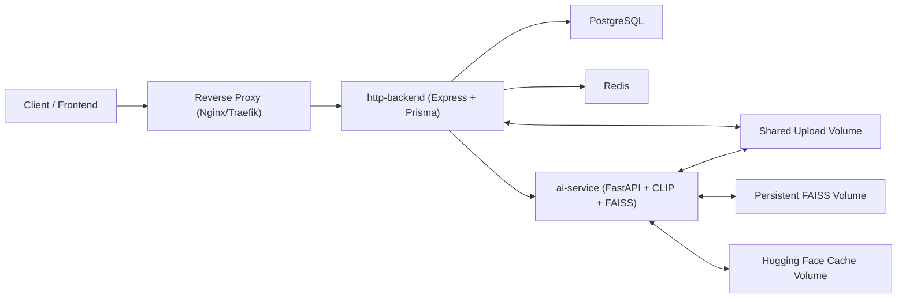

# SecurePixel

SecurePixel is a multi-service image protection platform built around an HTTP API, an AI image-processing service, PostgreSQL, Redis, and shared persistent storage for uploads and derived artifacts.

## Highlights

- JWT-based authentication with refresh token rotation
- OTP email verification via SMTP
- Image upload, detection, and ownership attribution workflows
- Layered duplicate detection using watermarking, perceptual hashing, and CLIP embeddings
- Persistent FAISS vector index for restart-safe AI similarity search
- Production-ready Docker Compose stack with health checks and named volumes

## Repository Layout

```text
.
|-- ai-service/               # FastAPI + FAISS + CLIP inference service
|-- http-backend/             # Express + Prisma + Redis rate limiting API
|-- uploads/                  # Local development upload directory
|-- docker-compose.yml        # Production-oriented multi-service stack
`-- .env.example              # Sanitized environment template
```

## System Architecture



## Services

### `http-backend`

Responsibilities:

- Exposes authentication and image APIs
- Stores users, image metadata, embeddings, and refresh tokens in PostgreSQL
- Applies Redis-backed rate limiting
- Calls the AI service for watermarking, pHash extraction, CLIP embeddings, and FAISS search
- Serves uploaded and secured images from the shared uploads volume

Default port:

- `3000`

Key runtime dependencies:

- PostgreSQL
- Redis
- `ai-service`
- Shared uploads volume
- SMTP provider

### `ai-service`

Responsibilities:

- Generates CLIP embeddings
- Encodes and decodes image watermarks
- Extracts perceptual hashes and image features
- Performs vector similarity search using FAISS
- Persists FAISS index and ID map to disk

Default port:

- `8000` on the internal Docker network only

Key runtime dependencies:

- Shared uploads volume
- Persistent FAISS data volume
- Hugging Face cache volume

### `postgres`

Responsibilities:

- Primary transactional data store for users, images, and refresh tokens

### `redis`

Responsibilities:

- Centralized rate-limit state storage

## Internal Networking

### Publicly exposed

- `http-backend` should be exposed only through a reverse proxy in production.

### Internal only

- `ai-service`
- `postgres`
- `redis`

### Docker networks

- `app_net`: application-to-application traffic between `http-backend` and `ai-service`
- `data_net`: backend access to PostgreSQL and Redis

## Request Flow

### Upload flow

1. A client uploads an image to `http-backend`.
2. The backend stores the original file on the shared uploads volume and creates the initial `Image` record in PostgreSQL.
3. The backend calls `ai-service /process-image`.
4. The AI service computes:
   - perceptual hash
   - CLIP embedding
   - secured image with embedded watermark
5. The backend updates PostgreSQL with pHash, embedding, and secured image path.
6. The backend sends the embedding to the AI service FAISS index.

### Detect flow

1. A client uploads a candidate image to `http-backend /detect`.
2. The backend sends the shared file path to the AI service.
3. The AI service returns:
   - decoded watermark candidate
   - pHash variations
   - CLIP embedding
4. The backend checks:
   - Layer 1: embedded watermark ownership match
   - Layer 2: PostgreSQL pHash near-match query
   - Layer 3: FAISS similarity search
5. The backend returns duplicate ownership metadata when available.

## Persistent Data

Docker named volumes are used for stateful data:

- `postgres_data`: PostgreSQL data directory
- `redis_data`: Redis append-only persistence
- `uploads_data`: original and secured images
- `faiss_data`: FAISS binary index and ID map
- `huggingface_cache`: downloaded CLIP model artifacts

## Environment Variables

Copy the template and fill in real secrets:

```bash
cp .env.example .env
```

Important variables:

| Variable | Used By | Purpose |
|---|---|---|
| `POSTGRES_DB` | Compose/Postgres | Database name |
| `POSTGRES_USER` | Compose/Postgres | Database username |
| `POSTGRES_PASSWORD` | Compose/Postgres | Database password |
| `DATABASE_URL` | `http-backend` | Prisma/PostgreSQL connection string |
| `PORT` | `http-backend` | API listen port inside container |
| `NODE_ENV` | `http-backend` | Runtime mode, should be `production` in deploys |
| `AI_SERVICE_URL` | `http-backend` | Internal URL for the FastAPI service |
| `REDIS_URL` | `http-backend` | Redis connection string |
| `SMTP_HOST` | `http-backend` | Mail server hostname |
| `SMTP_PORT` | `http-backend` | Mail server port |
| `SMTP_USER` | `http-backend` | SMTP username |
| `SMTP_PASS` | `http-backend` | SMTP password |
| `JWT_SECRET` | `http-backend` | Access-token signing secret |
| `JWT_REFRESH_SECRET` | `http-backend` | Refresh-token signing secret |
| `FAISS_INDEX_PATH` | `ai-service` | Path to persisted FAISS index |
| `FAISS_ID_MAP_PATH` | `ai-service` | Path to persisted FAISS ID map |
| `HF_HOME` | `ai-service` | Hugging Face model cache directory |

## Local Container Workflow

Build and start the stack:

```bash
docker compose up --build -d
```

Check health:

```bash
docker compose ps
docker compose logs -f http-backend
docker compose logs -f ai-service
```

Stop the stack:

```bash
docker compose down
```

Stop the stack and remove volumes:

```bash
docker compose down -v
```

## Production Deployment

### 1. Prepare the server

Install Docker and the Compose plugin on Ubuntu:

```bash
sudo apt-get update
sudo apt-get install -y ca-certificates curl gnupg
sudo install -m 0755 -d /etc/apt/keyrings
curl -fsSL https://download.docker.com/linux/ubuntu/gpg | sudo gpg --dearmor -o /etc/apt/keyrings/docker.gpg
sudo chmod a+r /etc/apt/keyrings/docker.gpg
echo \
  "deb [arch=$(dpkg --print-architecture) signed-by=/etc/apt/keyrings/docker.gpg] https://download.docker.com/linux/ubuntu \
  $(. /etc/os-release && echo \"$VERSION_CODENAME\") stable" | \
  sudo tee /etc/apt/sources.list.d/docker.list > /dev/null
sudo apt-get update
sudo apt-get install -y docker-ce docker-ce-cli containerd.io docker-buildx-plugin docker-compose-plugin
sudo usermod -aG docker $USER
newgrp docker
```

### 2. Fetch the code and configure secrets

```bash
git clone <your-repository-url> securepixel
cd securepixel
cp .env.example .env
chmod 600 .env
```

Populate `.env` with:

- strong unique JWT secrets
- real SMTP credentials
- strong PostgreSQL password
- production-safe hostnames and email settings

### 3. Build and launch

```bash
docker compose pull
docker compose build --pull
docker compose up -d
```

### 4. Operate the stack

Tail logs:

```bash
docker compose logs -f
docker compose logs -f http-backend
docker compose logs -f ai-service
```

Restart one service:

```bash
docker compose restart http-backend
```

Rebuild one service:

```bash
docker compose up -d --build http-backend
```

Graceful shutdown:

```bash
docker compose down
```

Full teardown including persisted data:

```bash
docker compose down -v
```

## Reverse Proxy and TLS

Bind the backend to loopback only and publish it through Nginx or Traefik. The provided Compose file already binds the API to `127.0.0.1`.

Example Nginx site configuration:

```nginx
server {
    listen 80;
    server_name api.example.com;

    location / {
        proxy_pass http://127.0.0.1:3000;
        proxy_http_version 1.1;
        proxy_set_header Host $host;
        proxy_set_header X-Real-IP $remote_addr;
        proxy_set_header X-Forwarded-For $proxy_add_x_forwarded_for;
        proxy_set_header X-Forwarded-Proto $scheme;
    }
}
```

Install a certificate with Certbot:

```bash
sudo apt-get install -y nginx certbot python3-certbot-nginx
sudo nginx -t
sudo systemctl reload nginx
sudo certbot --nginx -d api.example.com
```

## Operational Recommendations

- Rotate the SMTP password and JWT secrets before any deployment. The sample values previously used in local development should be treated as compromised.
- Set `NODE_ENV=production` in all deployed environments.
- Use `AI_SERVICE_URL=http://ai-service:8000` inside Docker.
- Keep `postgres`, `redis`, and `ai-service` off the public internet.
- Back up `postgres_data`, `uploads_data`, and `faiss_data` together to preserve metadata, originals, and vector state consistently.
- Consider moving SMTP and secret storage to a managed secret store such as AWS SSM, AWS Secrets Manager, 1Password Secrets Automation, Doppler, or Vault.
