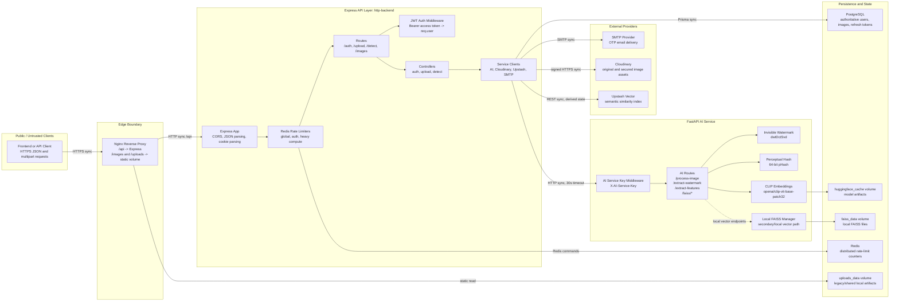
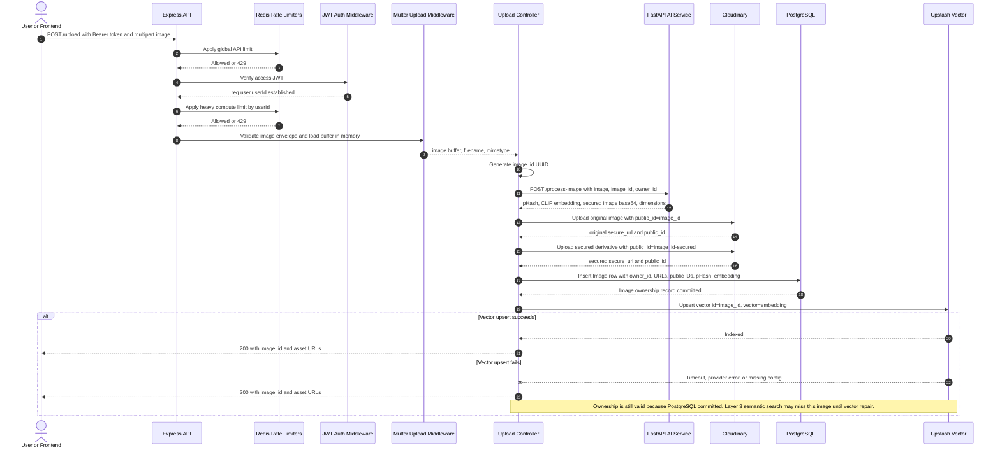
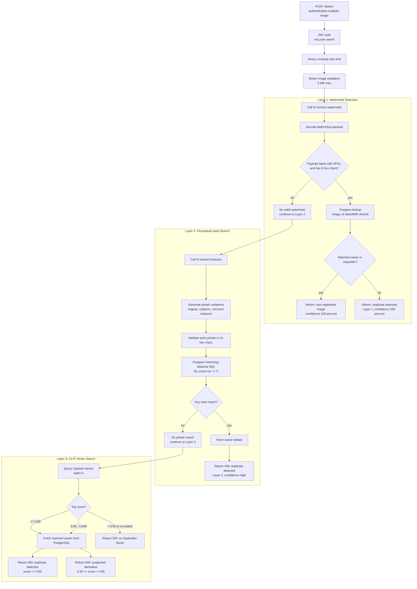
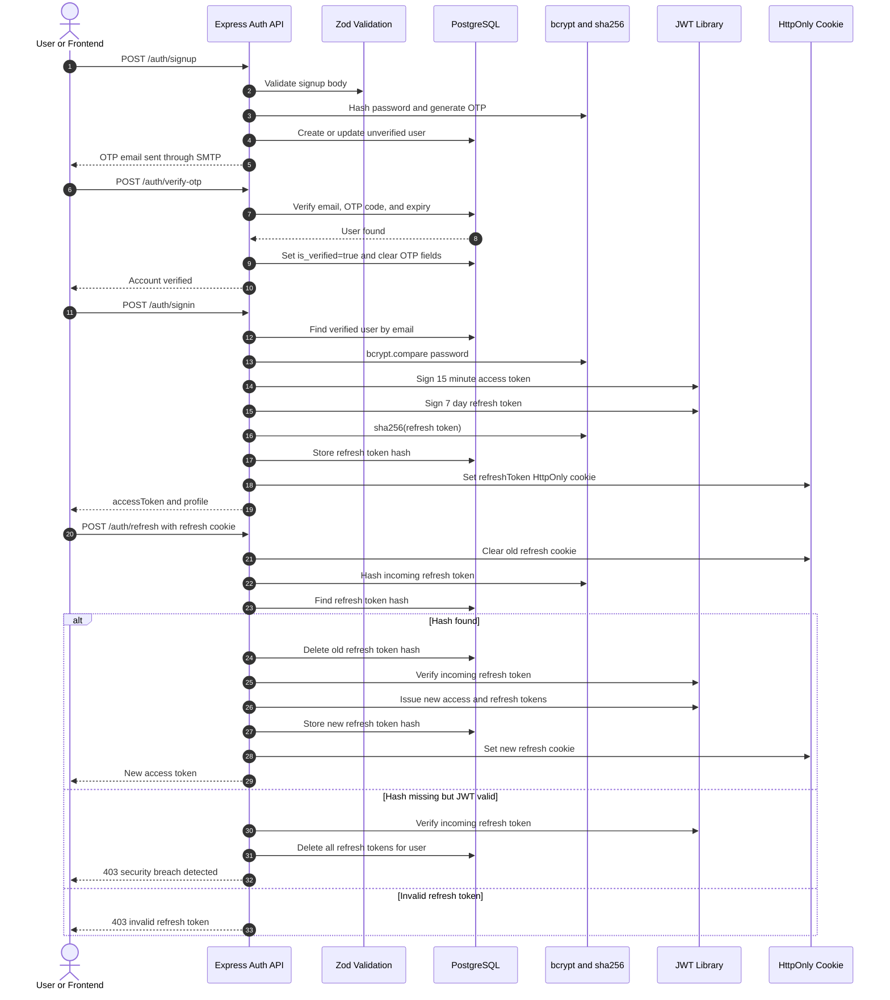
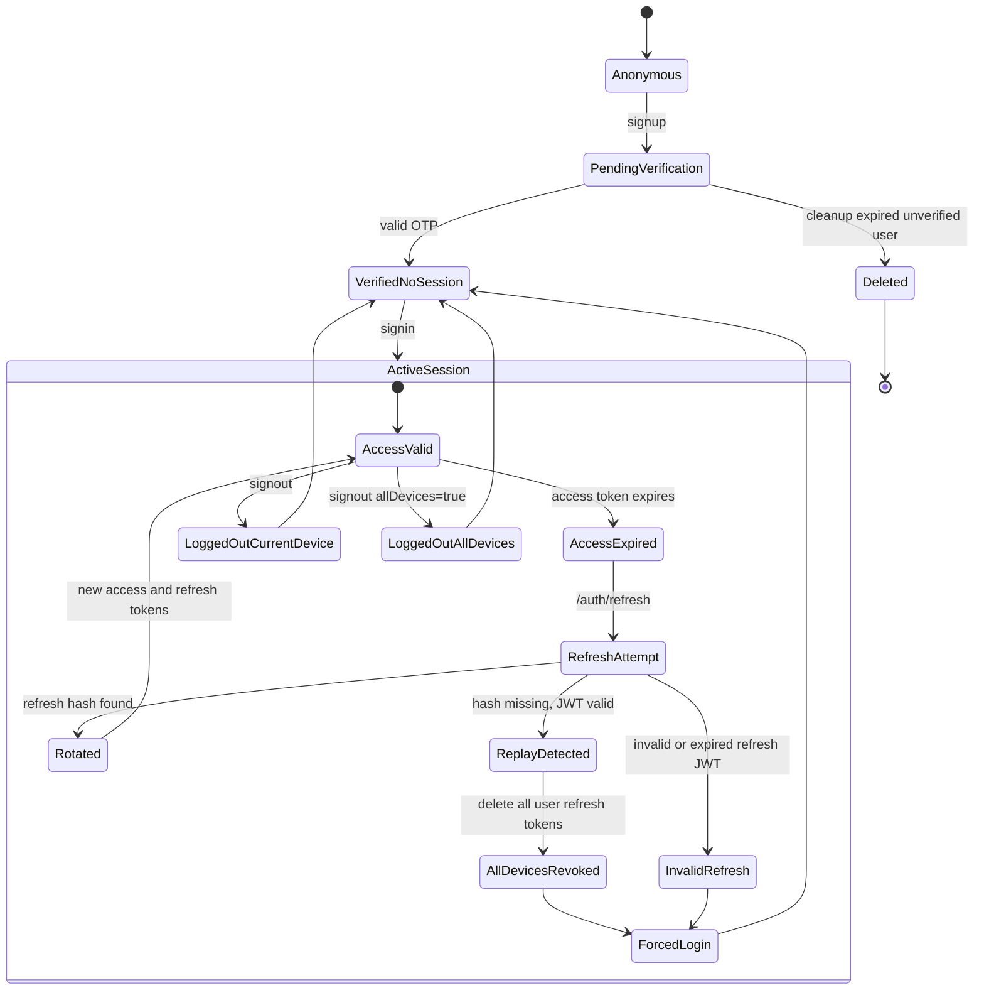
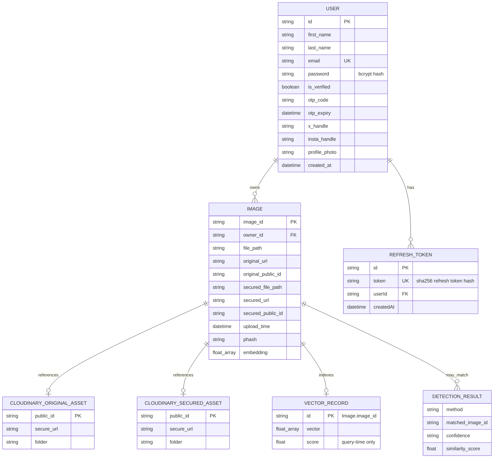
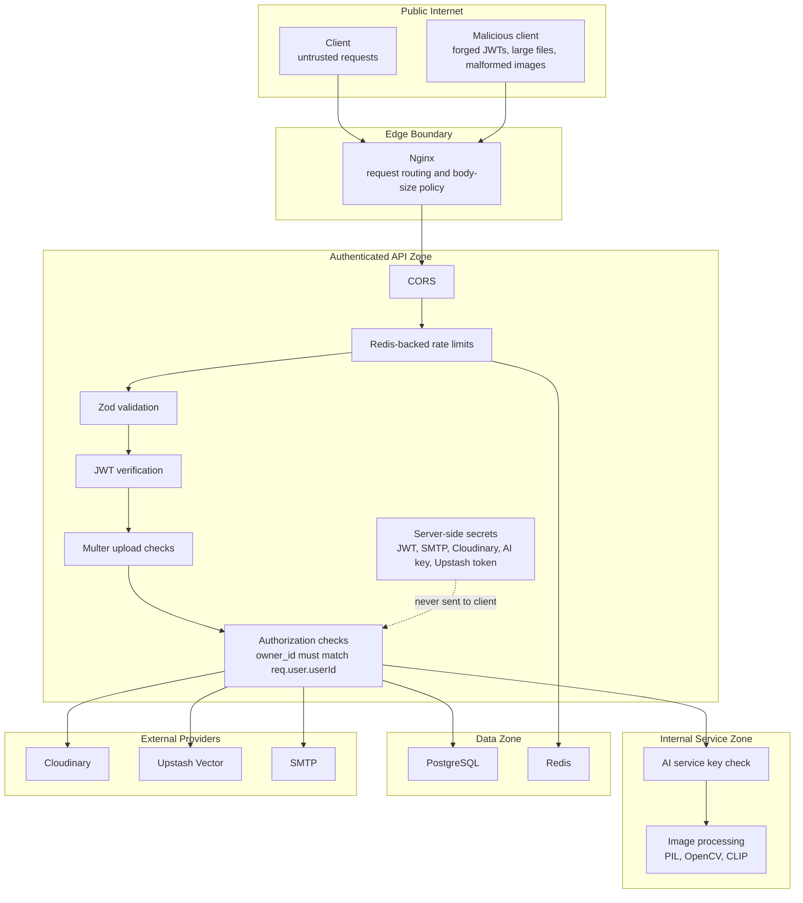
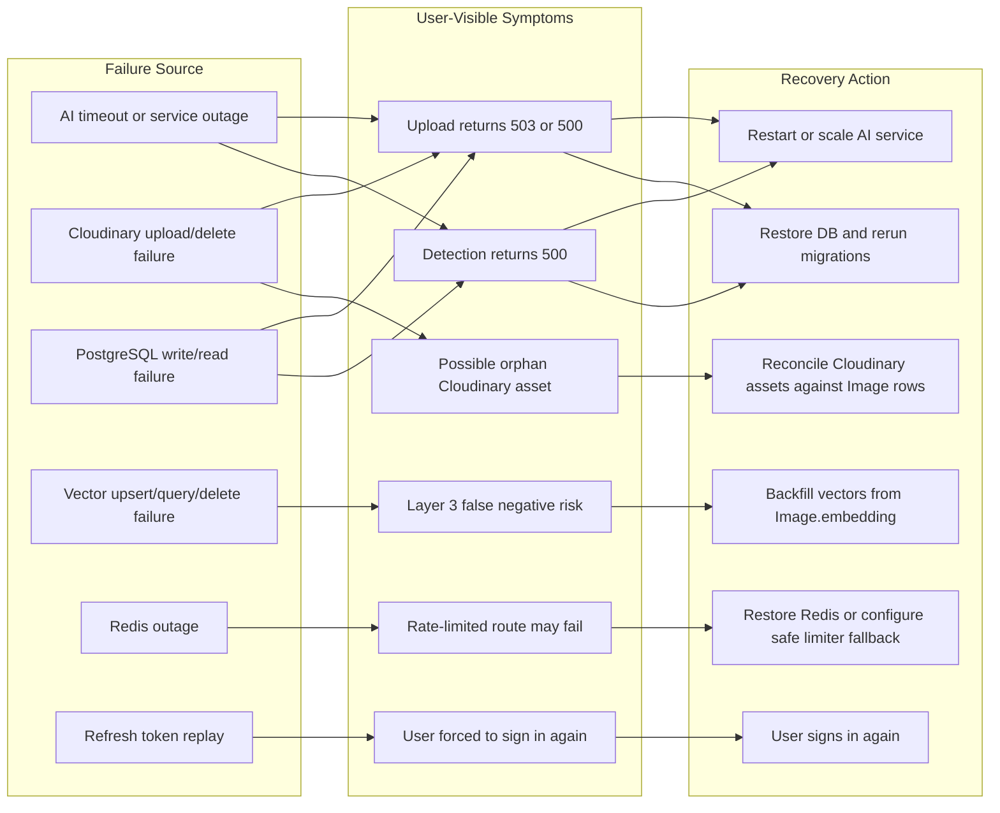
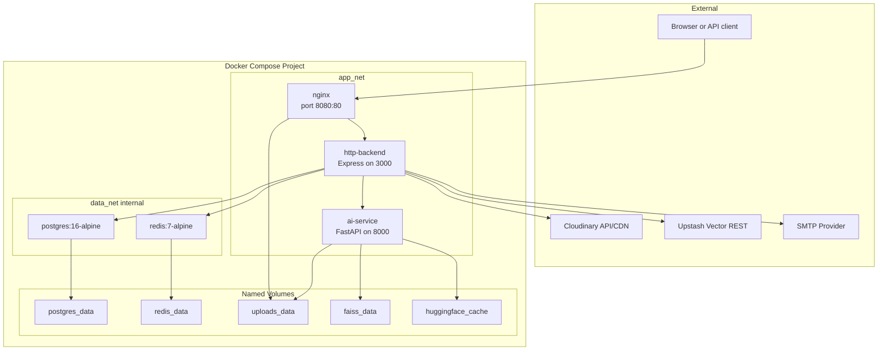

# SecurePixel

SecurePixel is an open-source, multi-service image ownership and duplicate-detection platform.

The core problem this system is built to solve is: prove and preserve image ownership across upload, transformation, storage, and later duplicate detection, while keeping identity/account operations separate from expensive image-understanding work.

The repository combines:

- An Express + TypeScript API for authentication, authorization, quotas, image workflows, and persistence.
- A FastAPI + Python AI service for watermarking, perceptual hashing, and CLIP image embeddings.
- PostgreSQL as the authoritative ownership database.
- Redis as shared rate-limit state.
- Cloudinary for original and secured image assets.
- Upstash Vector for semantic similarity search.
- Docker Compose and Nginx for local and production-oriented service topology.

## Project Status

SecurePixel is structured as an open-source backend platform. It is suitable for learning, experimentation, and extension, but production deployments should review the security, scaling, and consistency notes in this README before handling real user data.

Important implementation note:

- The current TypeScript backend uses Cloudinary for image storage and Upstash Vector for Layer 3 semantic search.
- The Python AI service still includes FAISS endpoints and a FAISS manager. Those are useful for local or future vector-index work, but they are not the primary vector-search path used by the current Express detection controller.

## What SecurePixel Builds

SecurePixel lets a verified user:

1. Create an account with OTP email verification.
2. Sign in with JWT access tokens and rotating refresh tokens.
3. Upload an image.
4. Generate a secured derivative containing an invisible ownership watermark.
5. Persist the ownership record in PostgreSQL.
6. Store original and secured assets in Cloudinary.
7. Index the image embedding in Upstash Vector.
8. Detect whether a later image is owned, duplicated, near-duplicated, or semantically similar.

## Repository Layout

```text
.
|-- ai-service/
|   |-- app/
|   |   |-- api/routes.py              # FastAPI routes for AI image operations
|   |   |-- core/model_loader.py       # CLIP model loading and embedding generation
|   |   |-- core/faiss_manager.py      # Local FAISS manager and persistence helpers
|   |   `-- services/watermark.py      # Invisible watermark encode/decode
|   |-- Dockerfile
|   `-- requirements.txt
|
|-- http-backend/
|   |-- prisma/schema.prisma           # PostgreSQL data model
|   |-- src/controllers/               # Auth, upload, and detection orchestration
|   |-- src/middlewares/               # Auth, validation, upload, rate limiting
|   |-- src/routes/                    # Express route definitions
|   |-- src/services/                  # AI, Cloudinary, Vector, email helpers
|   |-- Dockerfile
|   |-- package.json
|   `-- tsconfig.json
|
|-- nginx/nginx.conf                   # Reverse proxy and static asset routing
|-- docker-compose.yml                 # Multi-service deployment topology
|-- .env.example                       # Environment variable template
`-- README.md
```

## Master Architecture



## Service Responsibilities

### `http-backend`

The TypeScript backend owns user-facing API behavior and authoritative persistence.

Responsibilities:

- Exposes REST endpoints for authentication, image upload, image detection, image listing, and image deletion.
- Validates auth/profile inputs with Zod.
- Verifies JWT access tokens for protected routes.
- Stores users, images, refresh tokens, image metadata, pHash values, and embeddings through Prisma.
- Applies Redis-backed rate limits.
- Calls the Python AI service for expensive image-processing work.
- Uploads original and secured image assets to Cloudinary.
- Upserts and queries CLIP vectors through Upstash Vector.

### `ai-service`

The Python service owns image understanding and transformation.

Responsibilities:

- Loads the CLIP model once per process.
- Converts uploaded images into CLIP embeddings.
- Computes perceptual hashes.
- Generates pHash variations for rotated and mirrored images.
- Encodes invisible ownership watermarks.
- Decodes ownership watermark payloads.
- Provides local FAISS endpoints for vector sync, add, and search workflows.

### `postgres`

PostgreSQL is the source of truth for:

- Users.
- Image ownership.
- Refresh token hashes.
- Image metadata.
- Stored pHash and embedding values.

### `redis`

Redis is shared operational state for:

- Global API rate limits.
- Auth endpoint rate limits.
- Heavy image-processing rate limits.

Redis does not store ownership or session truth.

### `cloudinary`

Cloudinary stores image assets:

- Original uploaded image.
- Secured watermarked derivative.

Cloudinary URLs and public IDs are referenced from PostgreSQL, but Cloudinary itself is not the ownership authority.

### `upstash vector`

Upstash Vector stores derived semantic search state:

- `id`: `image_id`
- `vector`: CLIP embedding

The vector index is not authoritative. A vector match must be resolved back through PostgreSQL before creator metadata is returned.

## Image Upload Flow



Upload invariants:

- The authenticated `userId` is the only allowed `owner_id`.
- The generated `image_id` anchors the original asset, secured asset, database row, watermark short ID, and vector record.
- PostgreSQL is the first authoritative ownership point.
- Cloudinary and Upstash are derived/external state and may require reconciliation after partial failures.

Upload failure behavior:

- If AI processing fails before Cloudinary uploads, no ownership state is created.
- If Cloudinary fails before database insert, the upload fails and cleanup is attempted for already uploaded assets.
- If PostgreSQL insert fails after Cloudinary uploads, cleanup is attempted for uploaded assets.
- If vector upsert fails after PostgreSQL insert, upload still succeeds and the semantic index becomes temporarily inconsistent.

## Image Detection Flow

SecurePixel uses layered detection so deterministic evidence is checked before probabilistic evidence.



Why the order matters:

- Watermark detection is the strongest signal when the secured derivative is still intact.
- pHash catches visually similar or lightly transformed images without relying on semantic model confidence.
- CLIP vector search catches edited, cropped, filtered, or semantically close images, but it is probabilistic and depends on derived vector state.

## Authentication and Token Rotation





Refresh-token invariants:

- Raw refresh tokens are not stored in PostgreSQL.
- Each refresh token should be used once.
- A missing stored hash combined with a still-valid refresh JWT is treated as replay or compromise.
- Multiple devices are represented by multiple refresh-token rows.

Known race condition:

- Two simultaneous refresh requests using the same valid refresh token can cause the second request to look like a replay after the first request deletes the token hash.

## Data Ownership Model



Data authority:

- Authoritative: `User`, `Image`, and `RefreshToken` rows in PostgreSQL.
- Derived: pHash values, CLIP embeddings, Cloudinary asset references, Upstash vectors.
- Ephemeral: uploaded request buffers, AI temp files, access tokens, Redis limiter counters.

## Trust and Security Boundaries



Security notes:

- All protected image routes require a valid access JWT.
- Refresh tokens are held in HttpOnly cookies and stored server-side only as SHA-256 hashes.
- The AI service can require `X-AI-Service-Key` for non-health endpoints.
- Cloudinary calls are signed server-side.
- Upstash Vector uses a server-side bearer token.
- Redis is trusted operational state, not authorization state.

## Failure and Recovery Map



## Deployment Topology



Scaling characteristics:

- `http-backend` can scale horizontally if all replicas share PostgreSQL, Redis, Cloudinary, Upstash, and identical JWT secrets.
- `ai-service` can scale horizontally for inference, but every replica needs model memory and startup time.
- PostgreSQL is the authoritative state bottleneck in the current Compose topology.
- Redis is a single operational dependency for rate limiting.
- The pHash SQL query path will need a better index or search structure as image count grows.
- Vector consistency needs a retryable outbox or reconciliation job for production-grade reliability.

## API Overview

All API routes are served by `http-backend`. When using the bundled Nginx config, API routes are available under `/api/*` and are rewritten to the Express app.

| Method | Path | Auth | Purpose |
|---|---:|---:|---|
| `GET` | `/health` | No | Full health check including database, Redis, and AI service |
| `GET` | `/healthz` | No | Container health check |
| `POST` | `/auth/signup` | No | Create or restart an unverified signup |
| `POST` | `/auth/verify-otp` | No | Verify email OTP |
| `POST` | `/auth/resend-otp` | No | Send a new OTP for an unverified user |
| `POST` | `/auth/signin` | No | Sign in and receive an access token |
| `POST` | `/auth/refresh` | Cookie | Rotate refresh token and issue a new access token |
| `POST` | `/auth/signout` | Cookie | Delete refresh token state |
| `PATCH` | `/auth/profile` | Bearer token | Update optional profile fields |
| `POST` | `/upload` | Bearer token | Upload, secure, persist, and index an image |
| `POST` | `/detect` | Bearer token | Detect ownership, duplicate, or derivative image |
| `GET` | `/images` | Bearer token | List authenticated user's images |
| `DELETE` | `/images/:id` | Bearer token | Delete an owned image and best-effort derived state |

## Environment Variables

Copy the template and fill in real values:

```bash
cp .env.example .env
```

Important variables:

| Variable | Used By | Purpose |
|---|---|---|
| `POSTGRES_DB` | Compose/Postgres | Database name |
| `POSTGRES_USER` | Compose/Postgres | Database user |
| `POSTGRES_PASSWORD` | Compose/Postgres | Database password |
| `DATABASE_URL` | `http-backend` | Prisma PostgreSQL connection string |
| `PORT` | `http-backend` | Express listen port |
| `NODE_ENV` | `http-backend` | Runtime mode |
| `ALLOWED_ORIGINS` | `http-backend` | Comma-separated CORS allowlist |
| `JWT_SECRET` | `http-backend` | Access token signing secret |
| `JWT_REFRESH_SECRET` | `http-backend` | Refresh token signing secret |
| `SMTP_HOST` | `http-backend` | OTP email SMTP host |
| `SMTP_PORT` | `http-backend` | OTP email SMTP port |
| `SMTP_USER` | `http-backend` | SMTP username |
| `SMTP_PASS` | `http-backend` | SMTP password |
| `REDIS_URL` | `http-backend` | Redis connection string |
| `AI_SERVICE_URL` | `http-backend` | Internal FastAPI service URL |
| `AI_SERVICE_API_KEY` | `http-backend`, `ai-service` | Shared key for API-to-AI calls |
| `CLOUDINARY_CLOUD_NAME` | `http-backend` | Cloudinary cloud name |
| `CLOUDINARY_API_KEY` | `http-backend` | Cloudinary API key |
| `CLOUDINARY_API_SECRET` | `http-backend` | Cloudinary API secret |
| `CLOUDINARY_FOLDER` | `http-backend` | Cloudinary folder prefix |
| `UPSTASH_VECTOR_REST_URL` | `http-backend` | Upstash Vector REST endpoint |
| `UPSTASH_VECTOR_REST_TOKEN` | `http-backend` | Upstash Vector bearer token |
| `FAISS_INDEX_PATH` | `ai-service` | Intended local FAISS index path |
| `FAISS_ID_MAP_PATH` | `ai-service` | Intended local FAISS ID map path |
| `HF_HOME` | `ai-service` | Hugging Face model cache directory |

Security reminder:

- Do not commit `.env`.
- Rotate secrets before any public deployment.
- Treat any secret committed to a public repository as compromised.

## Local Development

### Run with Docker Compose

```bash
docker compose up --build -d
```

Check service state:

```bash
docker compose ps
docker compose logs -f http-backend
docker compose logs -f ai-service
```

Stop the stack:

```bash
docker compose down
```

Stop and remove all volumes:

```bash
docker compose down -v
```

### Build the TypeScript backend locally

```bash
cd http-backend
npm install
npx prisma generate
npm run build
```

### Run the TypeScript backend locally

```bash
cd http-backend
npm run dev
```

The local backend expects compatible PostgreSQL, Redis, AI service, SMTP, Cloudinary, and optional Upstash Vector configuration.

### Run the AI service locally

```bash
cd ai-service
python -m venv .venv
.venv\Scripts\activate
pip install -r requirements.txt
uvicorn app.main:app --host 0.0.0.0 --port 8000
```

On Linux or macOS, activate the virtual environment with:

```bash
source .venv/bin/activate
```

## Production Notes

For production-like deployments:

- Keep `postgres`, `redis`, and `ai-service` off the public internet.
- Serve the API through a reverse proxy with TLS.
- Use strong unique JWT secrets and SMTP credentials.
- Use managed secret storage instead of plain environment files where possible.
- Back up PostgreSQL first. It is the ownership source of truth.
- Reconcile PostgreSQL, Cloudinary, and Upstash Vector regularly.
- Add retryable background jobs for vector indexing and asset cleanup before high-volume use.
- Add tests before accepting external contributions that change auth, ownership, detection, or persistence behavior.

## Known Architecture Risks

These are not blockers for learning or experimentation, but they matter for serious production use:

- Refresh token races: concurrent refresh requests can look like replay.
- Short watermark IDs: the watermark stores the first 8 UUID hex characters, so collision handling should be improved for large image counts.
- Vector drift: Upstash upsert/delete is best effort in the current upload/delete flows.
- pHash scaling: raw Hamming-distance SQL over many rows will become expensive as the image table grows.
- Cloudinary orphans: external asset cleanup is best effort after partial failures.
- Generated Prisma client: run `npx prisma generate` after schema changes and before local builds.

## Contributing

Contributions are welcome.

Good first areas:

- Add tests for auth refresh rotation and replay behavior.
- Add integration tests for upload and detection flows.
- Add a vector-sync outbox with retry workers.
- Add Cloudinary reconciliation tooling.
- Improve pHash search indexing.
- Add collision-resistant watermark ID handling.
- Document frontend integration examples.

Before opening a pull request:

1. Keep changes focused.
2. Do not commit secrets.
3. Update this README when architecture or deployment behavior changes.
4. Run the relevant build commands.
5. Explain any new persistence, security, or external-provider assumptions.

## License

This repository currently uses the package metadata license from `http-backend/package.json`. Add a root `LICENSE` file before publishing the project as a formal open-source release.
